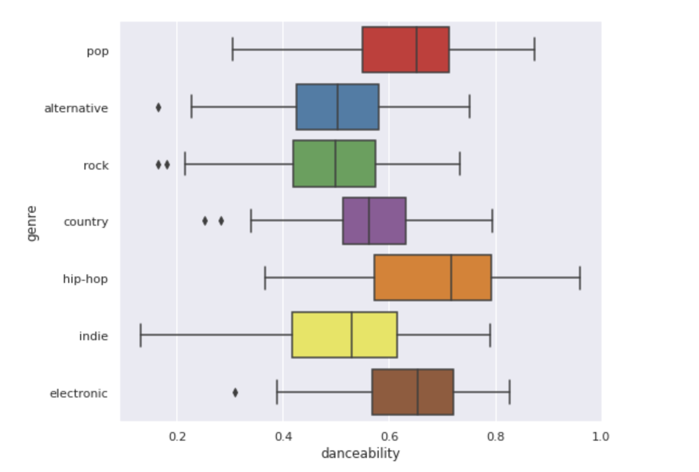
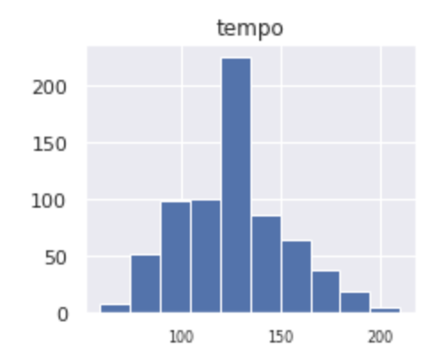
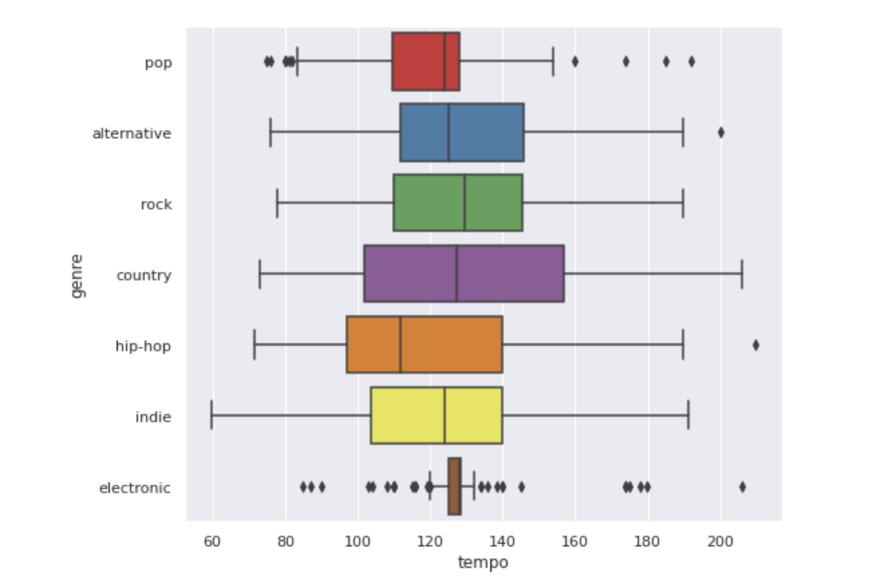

# Music Segmentation Unsupervised Learning_Project

Collect and cluster top 100 hits from different music genres.

Traditionally songs are grouped together with other songs on the basis of genre. While this method of grouping is useful for identifying different styles, there may be other valuable ways to group songs together. The aim of this study is to apply clustering algorithms to an assorment of songs across generes and explore cluster centers to determine if the the algorithms grouped songs together on the basis of genre, or in another way that is or is not of value. 
 
</img>

# DATA:

The data for this project is sourced from Spotify
- Each playlist is created by Spotify, features the top 100 tracks for that genre, and is updated weekly

1) Top 100 Pop Tracks on Spotify
2) Top 100 Alternative Tracks on Spotify
3) Top 100 Rock Tracks on Spotify
4) Top 100 Country Tracks on Spotify
5) Top 100 Hip Hop Tracks on Spotify
6) Top 100 Indie Tracks on Spotify
7) Top 100 Electronic Tracks on Spotify

# DATA ANALYSIS:

# 1. Data Collection:
In this step I collect and concat all playlists

# 2. Exploratory Analysis:
In this step the relationships between each genre playlist amd the song metrics provided by Spotify.

# 3. Clustering:
In this step I run clustering algorithms on the unique dataset I put together to see if songs are clustered along genre lines or clustered in novel way. 

-----------------------------------------------------------------------------------------------------------

# Data Collection 

**Step 1 : Selecting the data**
The following steps were preformed using via google searches and Spotipy 

- Identify 7 top tracks playlists for different genres created by Spotify 
- Pip install Spotipy- Spotify's lighweight Python library for the Spotify Web API
- Import tracks from each Spotify playlist with the free audio features provided by Spotify
- The free audio features are...

     1) Danceability- how suitable a track is for dancing based on a combination of musical elements including tempo, rhythm          stability, beat strength, and overall regularity (1= most dancable)
     2) Energy- perceptual measure of intensity and activity (1= high energy)
     3) Acousticness- whether the track is acoustic (1= acoustic)
     4) Liveness- Detects the presence of an audience in the recording (1= live)
     5) Instrumentalness- Predicts whether a track contains no vocals (1= no vocals)
     6) Valence- describing the musical positiveness conveyed by a track (1= happy)
     7) Tempo- beats per minute (BPM)

**Step 2 : Aggregating the data**
The following steps were preformed using Python functionalities

- Scale tempo to be between 0-1 and store in a new column
- Add a genre column
- Concat all Spotify playlists 

- The df 

 </img>
 
# Exploratory Analysis
- I divide the analysis into the following parts:

**A) Danceability Analysis**: Analyze each genres' distribution for danceability

**B) Speechiness Analysis**: Analyze each genres' distribution for speechiness

**C) Energy Analysis**: Analyze each genres' distribution for energy

**D) Acousticness Analysis**: Analyze each genres' distribution for acousticness 

**E) Liveness Sales**: Analyze each genres' distribution for liveness

**F) Instrumentalness Sales**: Analyze each genres' distribution for instrumentalness

**G) Valence Sales**: Analyze each genres' distribution for valence

**H) Tempo Sales**: Analyze each genres' distribution for tempo

# A) Danceability Analysis :
**Step 1 : Visualize the data's distribution as a whole**

The following step is preformed using Matplotlib

</img>

### Conclusion: The danceability of songs range from approximately .1 to approximately .9, and peak at .6. Moreover, danceability visually appears to follow a normal distribution.

# A) Danceability Analysis  :
**Step 2 : Visualize each genres' ditribution**

The following step is preformed using Seaborn

</img>

### Conclusion: The most danceable genre is hip-hop, and the least danceable genres are indie alternative and rock.

# B) Speechiness Analysis :
**Step 1 : Visualize the data's distribution as a whole**

The following step is preformed using Matplotlib

</img>

### Conclusion: The speechiness of songs range from near 0 to approximately .5, and peak around .1. The distribution visually appears to be positively skewed with high kurtosis. 

# B) Speechiness Analysis  :
**Step 2 : Visualize each genres' ditribution**

The following step is preformed using Seaborn

</img>

### Conclusion: Hip-hop is by the genre with the highest speechiness.

# C) Energy Analysis :
**Step 1 : Visualize the data's distribution as a whole**

The following step is preformed using Matplotlib

</img>

### Conclusion: The energy of songs appear to peak around .9 follow a negatively skewed distribution.

# C) Energy Analysis  :
**Step 2 : Visualize each genres' ditribution**

The following step is preformed using Seaborn

</img>

### Conclusion: On average rock songs appear to have higher energy and hip-hop songs appear to have lower energy than songs from other genres. 

# D) Acousticness Analysis :
**Step 1 : Visualize the data's distribution as a whole**

The following step is preformed using Matplotlib

</img>

### Conclusion: The acousticness of songs appear to range from around 0 to .6 with few outliers around .8. Furthermore, the distribution is charachterized by a negative skew and high kurtosis.

# D) Acousticness Analysis  :
**Step 2 : Visualize each genres' ditribution**

The following step is preformed using Seaborn

</img>

### Conclusion: With few exceptions, the marjority of songs irregardless of genre have low acousticness. Still, the most acuostic genres are country and hip-hop. 

# E) Instrumentalness Analysis :
**Step 1 : Visualize the data's distribution as a whole**

The following step is preformed using Matplotlib

</img>

### Conclusion: The instrumentalness of songs approximately range between 0 and .9, and peak between 0 and .1. The distribution has high kurtosis and is negatively skewed.

# E) Instrumentalness Analysis  :
**Step 2 : Visualize each genres' ditribution**

The following step is preformed using Seaborn

</img>

### Conclusion: Indie has exceptionally high instrumentalness compared to other genres. Excluding country and hip-hop, all other genres have outliers with high intrumentalness.

# F) Liveness Analysis :
**Step 1 : Visualize the data's distribution as a whole**

The following step is preformed using Matplotlib

</img>

### Conclusion: The liveness of songs approximately range between 0 and .7 with few songs falling between .8 and .9. The distribution peaks betwen 0 and .2, and is negatively skewed.

# F) Liveness Analysis  :
**Step 2 : Visualize each genres' ditribution**

The following step is preformed using Seaborn

</img>

### Conclusion: Most genres appear to have low levels of liveness. 

# G) Valence Analysis :
**Step 1 : Visualize the data's distribution as a whole**

The following step is preformed using Matplotlib

</img>

### Conclusion: The valence of songs range from around 0 to 1, and peak around .5. The distribution is relatively symetrical. 

# G) Valence Analysis  :
**Step 2 : Visualize each genres' ditribution**

The following step is preformed using Seaborn

</img>

### Conclusion: The genre with the most valence is country. 

# H) Tempo Analysis :
**Step 1 : Visualize the data's distribution as a whole**

The following step is preformed using Matplotlib

</img>

### Conclusion: Tempo ranges from around 60 beats per minute (bpm) to 210 bpm. There is a stark peak around 120 bpm. 

# H) Tempo Analysis  :
**Step 2 : Visualize each genres' ditribution**

The following step is preformed using Seaborn

</img>

### Conclusion: Relative to other genres, hip-hop has the slowest tempo and electronic has the most narrow range of tempo. 

# Clustering

**Step 1 : Selecting Clustering Algorithms**
- KMeans
- DBSCAN
- Hierarchical

**Step 2 : Tuning Models**
- KMeans 
   * select optimal number of K
- DBSCAN
   * select optimal numbers for epsilon and minimum number of samples
- Hierarchical
   * slect optimal affinity and linkage
- Rerun models with tuned parameters

**Step 3 : Select Best Model**
- Compare silhouette scores and clusters of tuned models and select the best model
 
  
-----------------------------------------------------------------------------------------------------------

# Model Results :
- KMeans is the best preforming model 
- With K=4 , KMEans achieved a silhoutte score of .1935
- Visual comparison

</img>

</img>

- Numeric comparison

</img>
  
# Analysis Takeaways :
- The KMeans algorithm did not cluster along genre lines
- Instead it grouped songs of similar moods across genres, which can be valuable for creating genre- diverse playlists for occasions that require consistent energy
   * Runnning playlists
   * Party playlists
